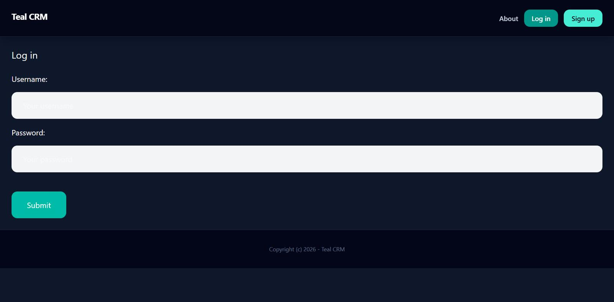
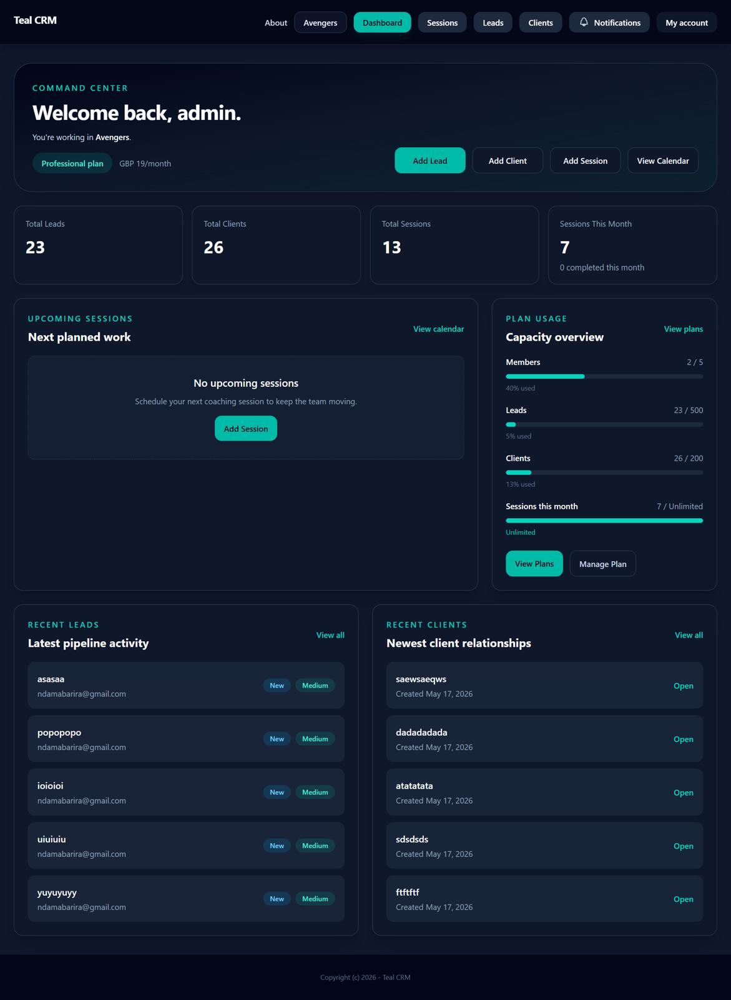
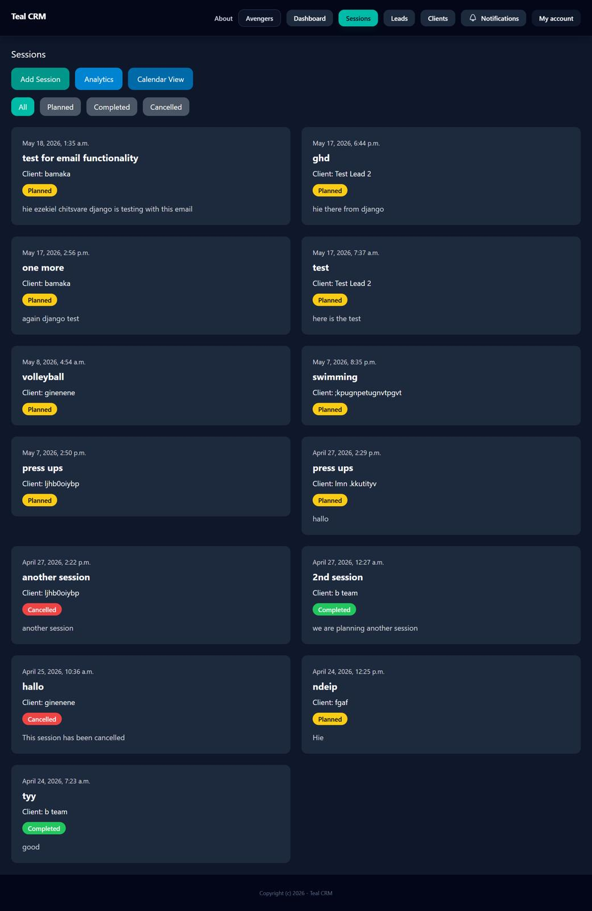
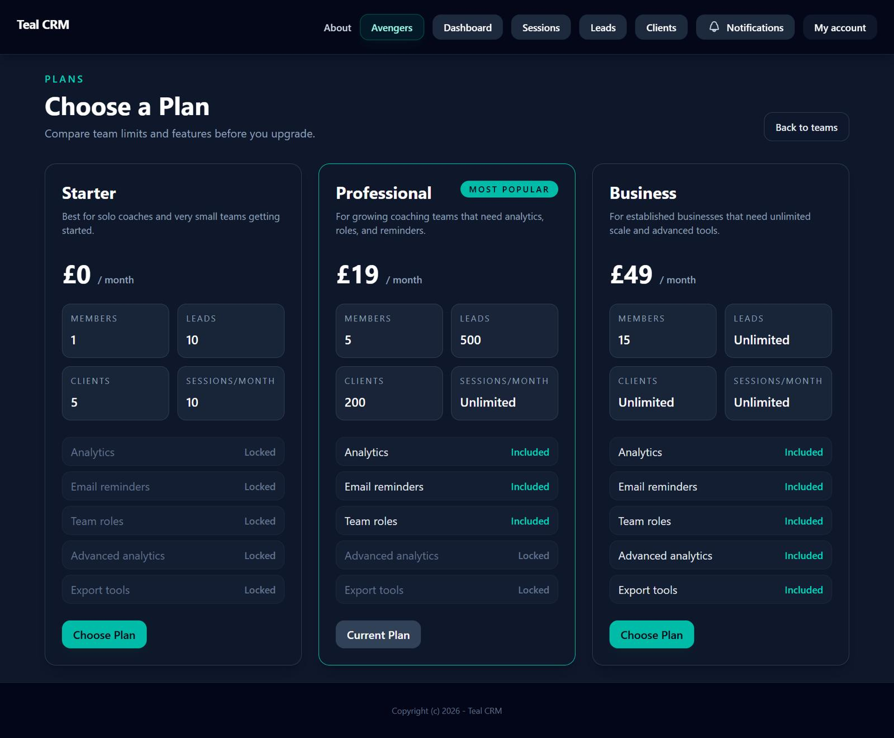
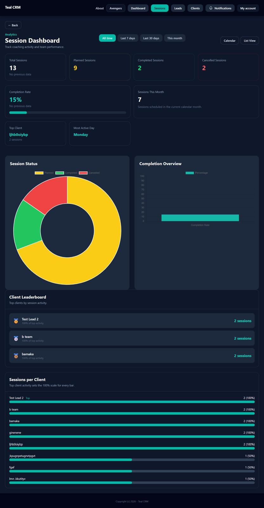
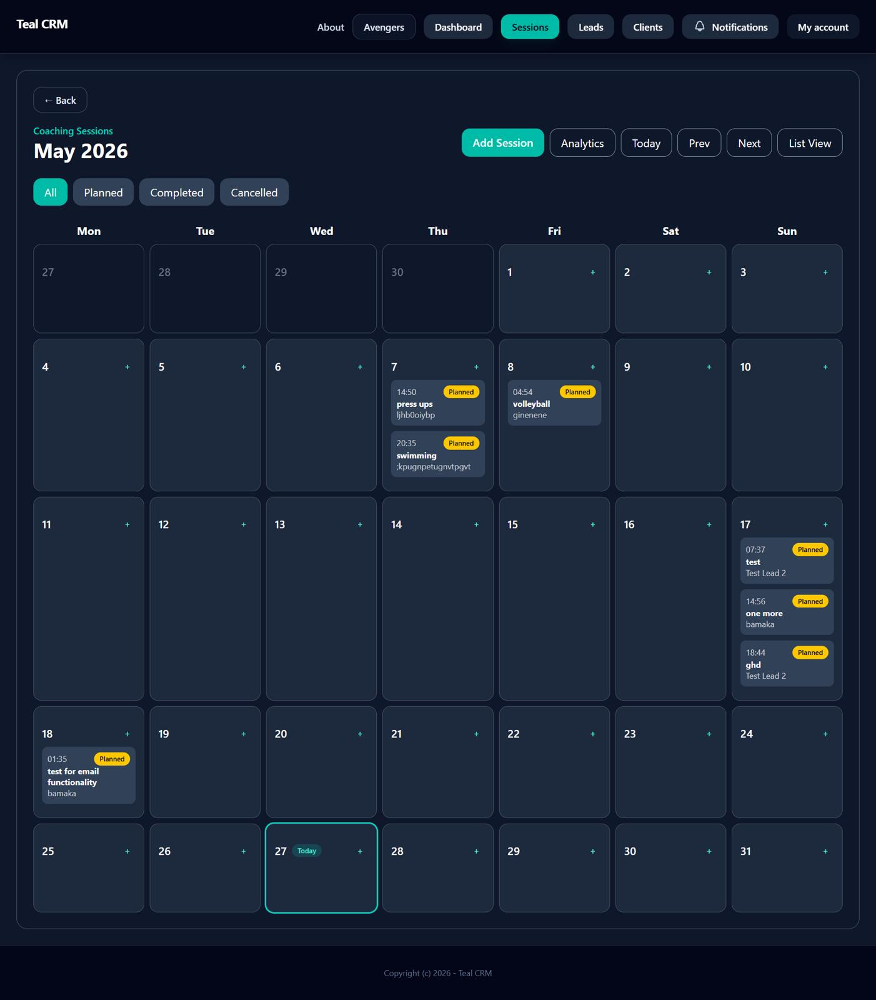

# Django Coach Management System

A web-based coach management system built with Django and Python to help manage coaches, clients, scheduling, records, and administrative workflows.

## Features

- Coach management
- Client management
- Scheduling system
- User authentication
- Dashboard and reporting
- Session tracking
- Administrative tools

## Technologies Used

- Python
- Django
- HTML5
- CSS3
- Bootstrap
- SQLite
- Git & GitHub

## Purpose

This project was built to improve management workflows for coaching and client administration.

## Project Status

Currently under active development.

## Installation

```bash
git clone https://github.com/ezekielchitsvare/django-coach-management-system.git

## Screenshots

### Login Page


### Dashboard


### Sessions Management


### Plans Management


### Analytics


### Calendar
